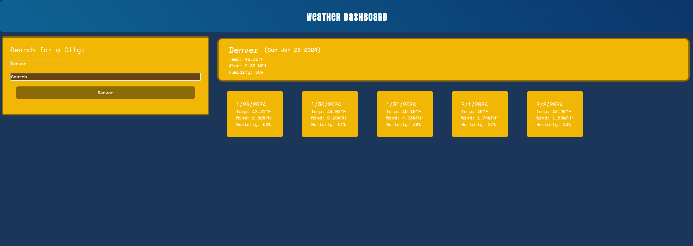

# Weather-Website
https://juanthtgotaway.github.io/Weather-Website/

## Description
The motive behind this program was to test our skills using APIs. We got to test our skills by creating a website that used a weather api to show a display of a 5 day forecast for a city user would look up. Along this project I learned a lot of imporant things such as the following:
* How to reset styles. For the longest time I could not get the styles desired to show up which took up a lot of my time. Thus I had to create the Reset.css to help create a blank slate for me to work on and allow the styles inputed to display such as I had intended on my code.  
* How to debug as when I would launch my page there would be an issue where old code would render, even though the code saved was obviously not what was saved. Thankfully for me, other people had this same issue before and it seemed like it was an easy fix of clearing cache, but only after spending time removing website and re-lauching in hopes it would update (article below).

## Table of Contents
[Descriptions](#Descriptions)
[Installation](#Installation)
[Usage](#Usage)
[Credits](#Credits)
[Tests](#Tests)
[License](#License)
[Questions](##Questions)

## Installation
In order to install this project you will have to clone the repository: 
    1. Create a place where you will want to store all this information 
    2. Once there open GitBash
    3. Clone this repository into the file you will have this stored in
            enter following: git@github.com:juanthtgotaway/Weather-Website.git
    4. Press enter to create your local clone

## Usage
This can be used to write down ideas or tasks 

## Credits
https://openweathermap.org/forecast5
https://github.com/orgs/community/discussions/19713

## Tests
N/A
## License
N/A

## Questions
If you have any questions or concerns feel free to reach out via the following:
GitHub:[juanthtgotaway](https://github.com/juanthtgotaway)